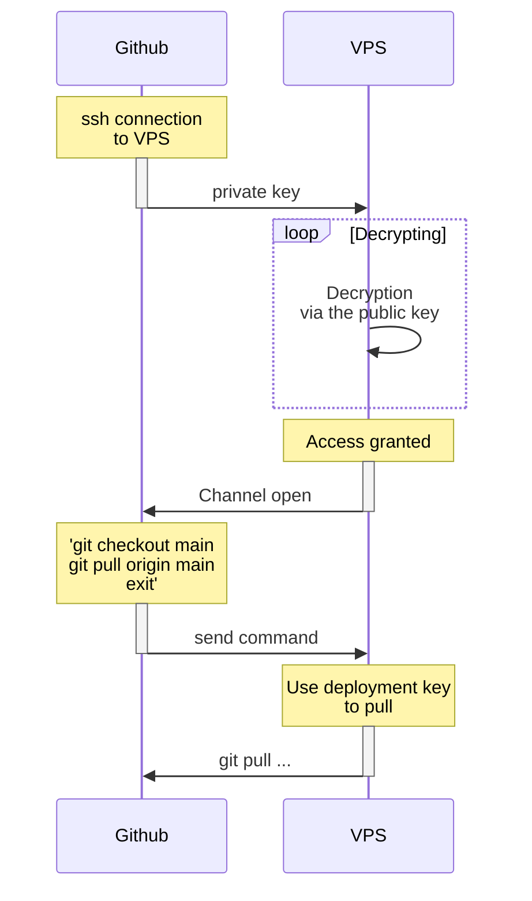

# Continuous Integration, Continuous Delivery

## Pipelines

## Deployment keys

To be able to deploy your stack on your VPS, you'll need an ssh connection. A good practice is to use a **deployment key**.

Deployment keys are ssh pairs that are usually unique to a project and that allows you to connect to your repository, [they can only **pull content from the repository**](https://github.blog/2015-06-16-read-only-deploy-keys/), they do not have the right to push content (why would you push content from your VPS to your repository anyway ?).

Note that if you want to use only one pair of keys (eg the deployment keys), GitHub, GitLab, BitBucket, whatever solution you chose, will need to have **both the private key** and the **public key** stored as secrets so that the pipeline work.

Why :

1. Your runner will have to connect to your VPS via ssh, thus **it will need the private key**.
2. Once you're in your VPS via the ssh connection from the runner, you'll have to pull the content from your repository. **Hence the need to know the public key**.

That is not mandatory, you can :

1. create ssh keys for your runner to connect to your VPS.
2. create a deployment key for your VPS to be able to pull your repo.

Anyways, both keys will have to be created on your VPS side.
