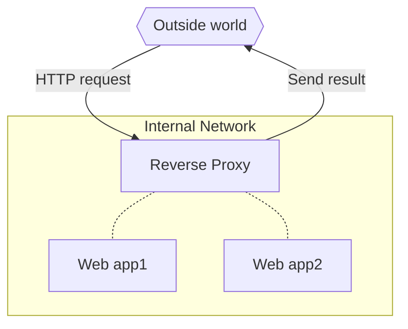

# Reverse proxy and https

## How does a reverse proxy work

A reverse proxy works as the gateway to several web applications; all traffic goes to the reverse proxy, and it decides which app to get the content from. It can cache responses and mutate them before sending them back to the client.

Thus it creates a layer between web applications and the outside world. Speaking in terms of containers, **a reverse proxy is the only container with published ports** : it receives all incoming requests and fetches the responses from other containers. That means all your application containers become internal components, which can make it easier to scale, update, and secure them.

The reverse proxy catches the http request, then fetches the result from the corresponding web app and send it back.

The host having done the request doesn't know where the web app it gets the result from is located, **its only interaction is with the reverse proxy**.



### Example

Suppose you have developed your api using FastAPI, then you can test it locally by running the following (or similar) command.

```shell
uvicorn app.main:app --reload --workers 1 --host 0.0.0.0
```

and then you should get the following response on the terminal.

```
INFO:     Started server process [1]
INFO:     Waiting for application startup.
INFO:     Application startup complete.
INFO:     Uvicorn running on http://0.0.0.0:8000 (Press CTRL+C to quit)
```

```shell
docker run --rm -p 8001:80 vorphus/helloworld-api:1.0-slim
```

Meaning that your api will run locally on the following adress `http://0.0.0.0:8001`.

```
❯ http 0.0.0.0:8001/hello/
HTTP/1.1 200 OK
content-length: 17
content-type: application/json
date: Sat, 03 Sep 2022 20:16:07 GMT
server: uvicorn

{
    "Hello": "World"
}
```


## HTTPS

To do https with a reverse proxy, you'll need :

* a Domain Name, check [Name.com](https://www.name.com/) to buy one, the cheapest one can be around 2 euros for a year,
* and a VPS, you can but one for example on [DigitalOcean](https://cloud.digitalocean.com), for around 5 euros/month.

### Connect your domain name to your VPS

Now that you have a Domain Name, you have to connect it to your VPS. So first you'lle have to record your Domain Name to your VPS, in my case this is explained [here](https://docs.digitalocean.com/products/networking/dns/how-to/add-domains/), you'll need to add this domain to your project and create a [DNS record](https://docs.digitalocean.com/products/networking/dns/how-to/manage-records/). Setting The apex domain (@), and a wildcard (*) to get subdomains will be enough.

Now you have done that you need to change the Name Servers on your Domain Name provider side


```shell
whois mathieuklimczak.com
ping mathieuklimczak.com
dig @ns1.digitalocean.com mathieuklimczak.com NS
```


## Traefik

### Traefik base configuration

```yaml
--8<-- "docker-compose.traefik.yml"
```

### Traefik dev configuration

```yaml
--8<-- "docker-compose.traefik-dev.yml"
```

### Traefik prod configuration

```yaml
--8<-- "docker-compose.traefik-prod.yml"
```

## Keycloak
