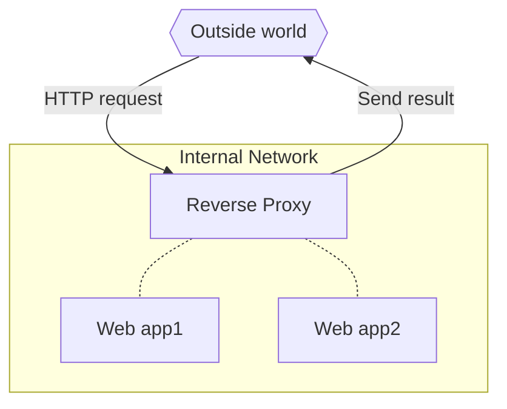

# Reverse proxy and https

## How does a reverse proxy work

A reverse proxy works as the gateway to several web applications; all traffic goes to the reverse proxy, and it decides which app to get the content from. It can cache responses and mutate them before sending them back to the client.

Thus it creates a layer between web applications and the outside world. Speaking in terms of containers, **a reverse proxy is the only container with published ports** : it receives all incoming requests and fetches the responses from other containers. That means all your application containers become internal components, which can make it easier to scale, update, and secure them.

The reverse proxy catches the http request, then fetches the result from the corresponding web app and sends it back.

The host which made the request doesn't know where the web app it gets the result from is located, **its only interaction is with the reverse proxy**.



### Example

Suppose you have developed your api using FastAPI ([this one](https://github.com/Klimorg/helloworld-api) for example), then you can test it locally by running the following (or similar) command.

```shell
uvicorn app.main:app --reload --workers 1 --host 0.0.0.0 --port 8000
```

and then you should get the following response on the terminal.

```
INFO:     Started server process [1]
INFO:     Waiting for application startup.
INFO:     Application startup complete.
INFO:     Uvicorn running on http://0.0.0.0:8000 (Press CTRL+C to quit)
```
Meaning that your api will run locally on the following address `http://0.0.0.0:8000`. You can even query it with tools like `httpie` or `curl`.

``` title="Querying with httpie"
❯ http 0.0.0.0:8000/hello/
HTTP/1.1 200 OK
content-length: 17
content-type: application/json
date: Sat, 03 Sep 2022 20:16:07 GMT
server: uvicorn

{
    "Hello": "World"
}
```

Now that you've tested your api, you want to deploy it. Like everybody, you turn it into a docker image so that you can deploy it anywhere (well, at least on any Linux host).

Let's say that your api is registered under [`vorphus/helloworld-api:1.0-slim`](https://hub.docker.com/repository/docker/vorphus/helloworld-api) on dockerhub.

```shell
docker pull vorphus/helloworld-api:1.0-slim
```

```shell
docker run --rm vorphus/helloworld-api:1.0-slim
```

You should get the same response than before on the terminal.

```
INFO:     Started server process [1]
INFO:     Waiting for application startup.
INFO:     Application startup complete.
INFO:     Uvicorn running on http://0.0.0.0:8000 (Press CTRL+C to quit)
```

But remember that **the port described here is internal to your docker network**, thus you have to forward it.

```
docker run --rm -p 8000:8000 vorphus/helloworld-api:1.0-slim
```
And now everything works.

```
❯ http 0.0.0.0:8000/hello/
HTTP/1.1 200 OK
content-length: 17
content-type: application/json
date: Sat, 03 Sep 2022 20:16:07 GMT
server: uvicorn

{
    "Hello": "World"
}
```

**TODO : write an example of localhost reverse proxy, like `fastapi.localhost`.**

You're all set. You can now deploy it to a VPS/web host and buy a Domain Name to easily access it and enable https.


## HTTPS

Note that https is not a property of reverse proxy, it's an internet communication protocol that protects the integrity and confidentiality of data between the user's computer and the site, but modern reverse proxies allow for an easy implementation of https.

* [Secure your site with HTTPS](https://developers.google.com/search/docs/advanced/security/https)

To do https with a reverse proxy, you'll need :

* A Domain Name, check [Name.com](https://www.name.com/) to buy one, the cheapest one can be around 2 euros for a year.
* A VPS, you can but one for example on [DigitalOcean](https://cloud.digitalocean.com), for around 5 euros/month. That's the solution I have chosen.

!!! quote

    **Domain names and web hosting are two different services**. However, they work together to make websites possible.

    Basically a domain name system is like a massive address book that is constantly updated. Behind each domain name, there is an address of the web hosting service storing the website’s files.

    Without domain names, it will not be possible for people to find your website and without web hosting you cannot build a website.

    [What’s the Difference Between Domain Name and Web Hosting (Explained)](https://www.wpbeginner.com/beginners-guide/whats-the-difference-between-domain-name-and-web-hosting-explained/)

### Connect your domain name to your VPS

Now that you have a Domain Name, you have to connect it to your VPS. So first you'lle have to record your Domain Name to your VPS, in my case this is explained [here](https://docs.digitalocean.com/products/networking/dns/how-to/add-domains/).

You'll need to add this domain to your project and create a [DNS record](https://docs.digitalocean.com/products/networking/dns/how-to/manage-records/). Setting The apex domain `@`, and a wildcard `*` to get subdomains will be enough.

Now you have done that you also might need to change the Name Servers on your Domain Name provider side.

The update of worldwide DNS servers might take some time, but once it is done, you'll be able to ping your VPS using your domain name.

You can use for example one of the following command, they do not do the same thing, but a response from one of them is a sign that the connection between tour domain name and your vps has succedded.

```shell
whois mathieuklimczak.com
ping mathieuklimczak.com
dig @ns1.digitalocean.com mathieuklimczak.com NS
```


## Traefik

[Traefik](https://doc.traefik.io/traefik/) is an open-source Edge Router that makes publishing your services a fun and easy experience. It receives requests on behalf of your system and finds out which components are responsible for handling them.

Traefik is natively compliant with every major cluster technology, such as Kubernetes, Docker, Docker Swarm, AWS, Mesos, Marathon, etc; and can handle many at the same time.

Dynamic configuration is one of the major benefits of a container-aware proxy like Traefik. You don’t need to start your upstream apps before you run Traefik because it watches for new containers while it’s running. You don’t have to restart Traefik or reload configuration to make a change to your application setup—that’s all part of your application deployment. Traefik has its own API and web UI that shows the rules, so you can run Traefik without any other containers and then deploy an application and see how the config gets built.

To do that, Traefik check the labels you put in the other containers of your stack to handle their connection to the virtual network created by the reverse proxy.

## Traefik configuration

To be able to have one configuration for each environment (dev, prod), we'll use the overriding and composition properties of docker-compose. That way, we have a base configuration which we can extend and override with the development or production configuration.

### Traefik base configuration

The base configuration is used for :

* Defining the container,
* Defining the porst we will use : `80` for http, `443` for https, and `8080` for the Traefik Dashboard.

We also tell Traefik that we will use Docker, so that the addresses it will have to redirect will comme from docker containers.

The network we will use will be the network called `traefik-public`, and it will be an external one, so that other containers like our backend, frontend, will be able to connect to it.

```yaml
--8<-- "docker-compose.traefik.yml"
```

### Traefik dev configuration

The configuration in development mode adds the address of the traefik dashboard : `monitor.localhost`.

```yaml
--8<-- "docker-compose.traefik-dev.yml"
```

### Traefik prod configuration

The configuration in development mode enables https.

```yaml
--8<-- "docker-compose.traefik-prod.yml"
```

## Caddy2
